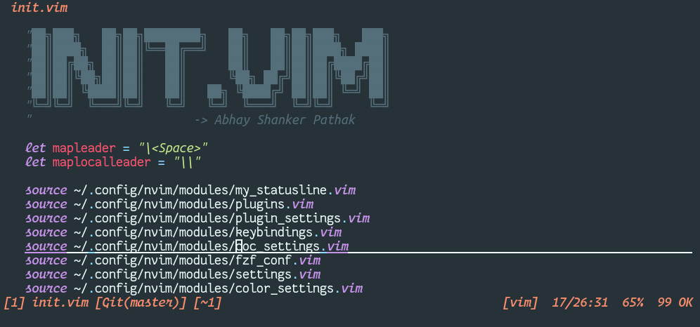
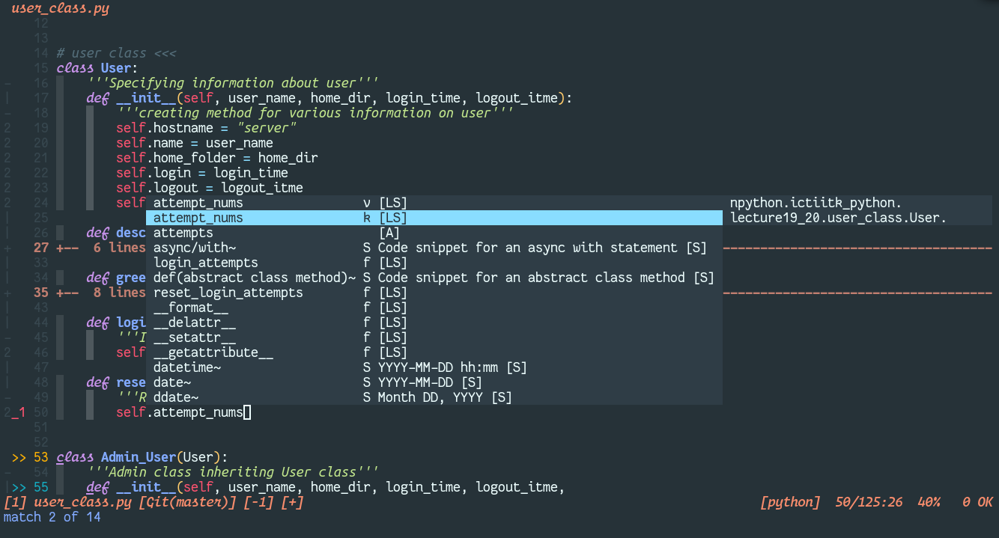
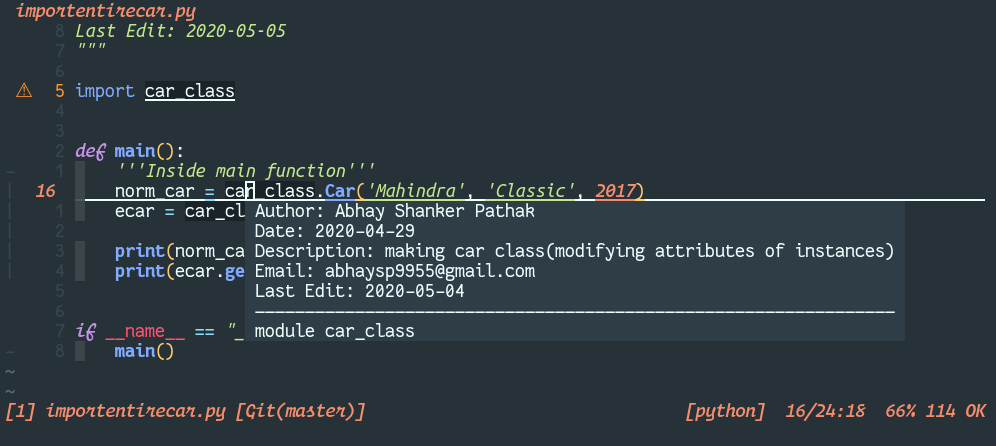
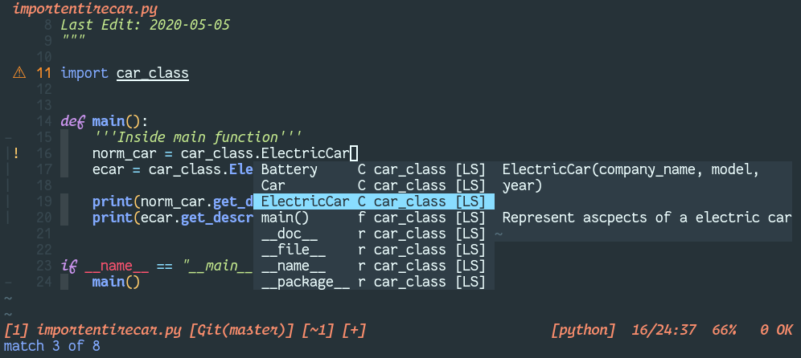
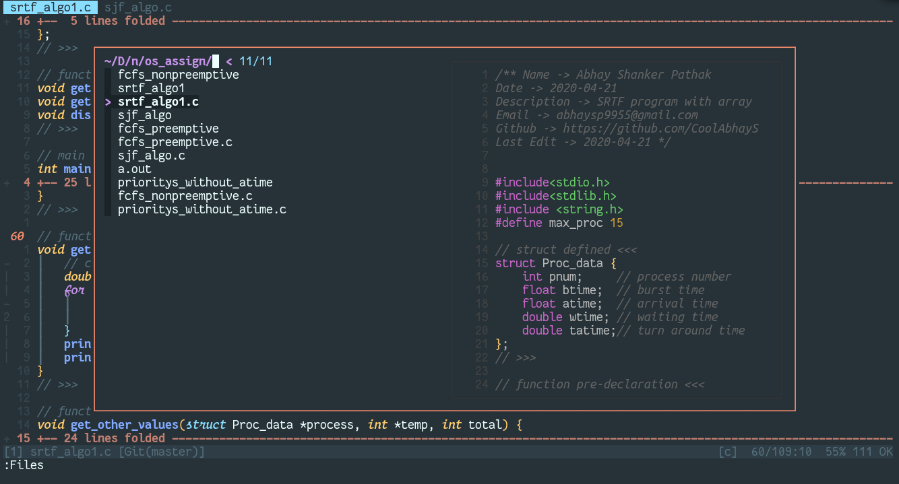
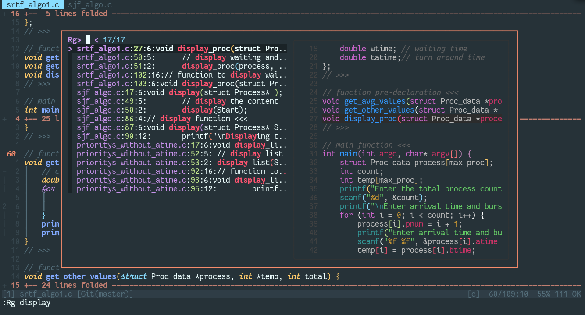

# Neovim

Currently, `nvim` is my primary text editor. I use it from editing config files
to do programming

# Features

I have added many features in the my configuration of text editor. Some of which
I got with the help of other peoples and some sites.

Here, are the main ones:

### Colorscheme

### One Dark(2020-05-06)
Started using [One Dark](https://github.com/joshdick/onedark.vim) colorscheme.

### Material(2020-05-02)

Using [material](https://github.com/kaicataldo/material.vim) colorscheme.

## AutoCompletion

I'm using [coc.nvim](https://github.com/neoclide/coc.nvim) and
[ultisnips](https://github.com/sirver/UltiSnips) for autocompletion.

## Intellisense and LSP

Using different _extensions_ and _language server_ with the help of `coc`

## File browsing

Using [fzf](https://github.com/junegunn/fzf.vim) for file browsing and getting to other commands.
Overall, fzf makes everytypes of browsing awesome

## Grepping in project

Using `rg` with combination of `fzf` which makes grepping insanly fast and awesome

