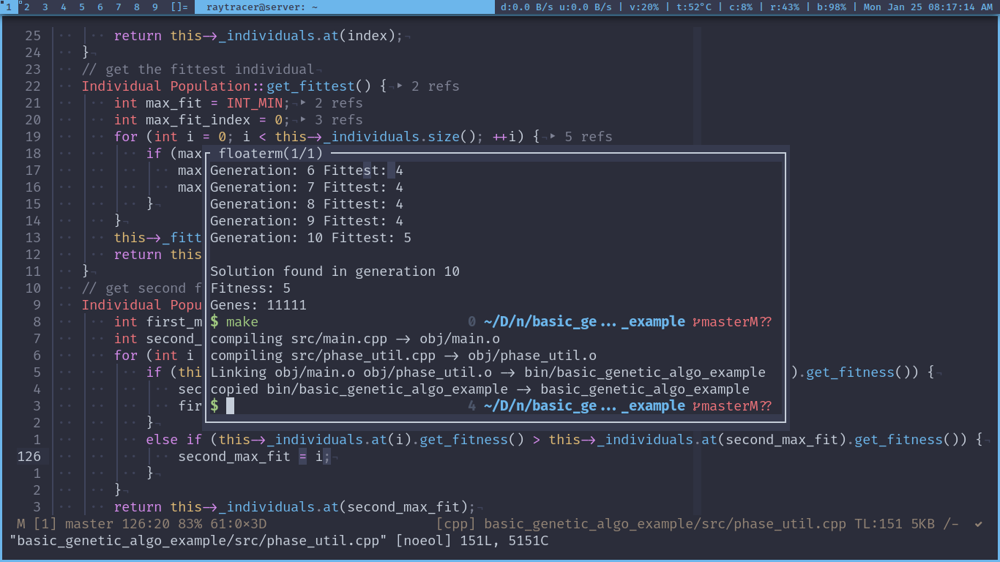
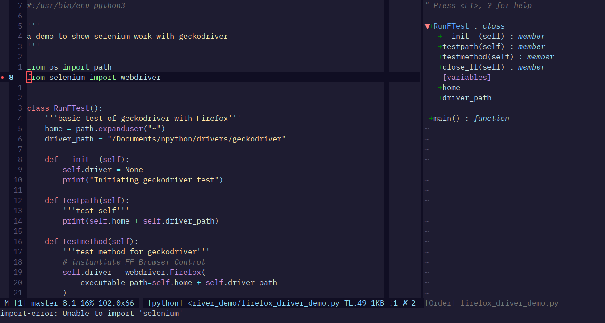
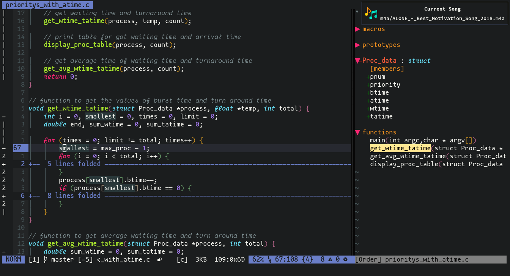
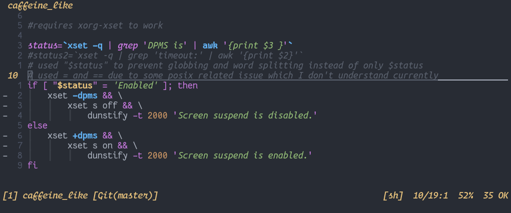
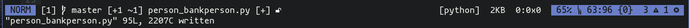
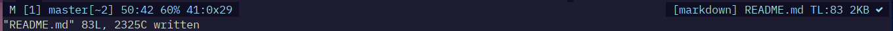
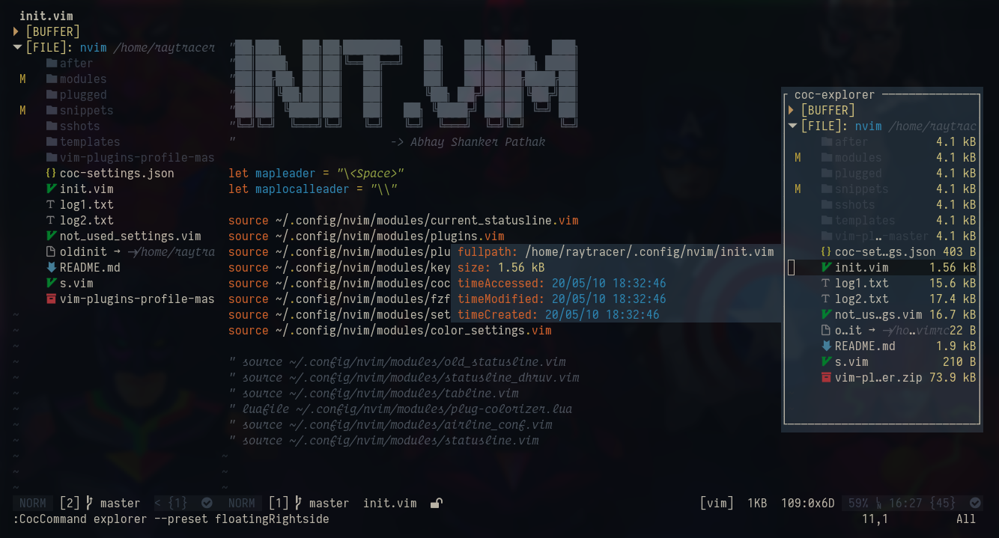

# Neovim

Currently, `nvim` is my primary text editor. I use it from editing config files
to do programming.

**Because I ♥️  N/vim**

# 😎 Features

I have added many features in the my configuration of text editor. Some of which
I got with the help of other peoples and some sites.

> Colorschemes for my text-editor and my other tools(terminal, bar etc.) are same

You can find my other config files at [my_config_files](https://github.com/coolabhays/my-config-files)

Here, are the main ones:

### 🎨 Colorscheme

All of the Colorschemes mentioned here are the 🏆

### Edge
Using [edge](https://github.com/sainnhe/edge)(aura) as main colorscheme. This theme is kinda mixup of `atom one` and `material`. This one works very well in dark as well as light environment and provides good syntax highlighting.

### Challenger Deep(Used for few days)
Switched to new [Challenger Deep](https://github.com/challenger-deep-theme/vim) colorscheme
This colorscheme is super 🔥

### Molokai(Used long time)
Switched to [molokai](https://github.com/tomasr/molokai) colorscheme

### One Dark(2020-05-06)
Started using [One Dark](https://github.com/joshdick/onedark.vim) colorscheme.

### Material(2020-05-02)

Using [material](https://github.com/kaicataldo/material.vim) colorscheme.

## StatusLine(Current)

Using manually setup statusline. Inspired by statusline of [Ahmed El Gabri](https://gabri.me/blog/diy-vim-statusline).

### Features

starting from left to right

**Left Portion:**

* Shows modifiable and non-modifiable state with `M` and `NM`
* Shows buffer number as `[1]`
* Shows git brach and git diff as `master[-4 ~4]`
* Shows line no. and column number as `50:1`
* Shows percentage of how much you scrolled in buffer as `34%`
* Shows _ascii_ and _hex value_ for character under cursor as `9:0x9`

**Right Portion:**

* Shows filetype as `[cpp]`
* Shows filename relative to path as `../../somepath/somefile.cpp`
* Shows total lines used in buffer as `TL:147`
* Shows file size opened in buffer as `4KB`
* Shows code linting status with help of ale for warning and error as `!0 x19`
* Shows code diagnosis status with help of coc-diagnostics as symbol in most right corner

`Note: coc supports the option to choose to use linting with ale or to use coc for it`

Here are few samples of my statusline(new to old):

**Sample1:**

This is my current statusline style. No added bling, no background color, only the stuff which is necessary

Below are some old sample of statusline

**Sample2**:

**Sample3:**

**Sample4:**

## File Exploring

I generally use `vim` commands to open files but if needed I use `coc-explorer` sometimes

## 👾AutoCompletion

I'm using [coc.nvim](https://github.com/neoclide/coc.nvim) and
[ultisnips](https://github.com/sirver/UltiSnips) for autocompletion.

## 👾 Intellisense and LSP

Using different _extensions_ and _language server_ with the help of `coc`

## File browsing

Vim is also known for it's super 🏃‍♂️  file browsing.
Using [fzf](https://github.com/junegunn/fzf.vim) for file browsing and getting to other commands.
Overall, fzf makes everytypes of browsing awesome

## 🦸‍♂️ Grepping in project

Using `rg` with combination of `fzf` which makes grepping insanly fast and awesome

